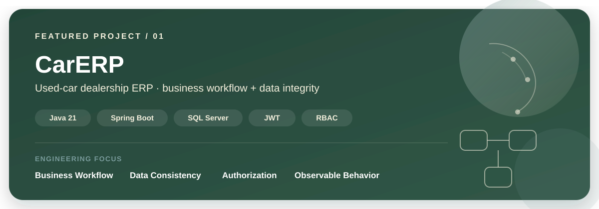
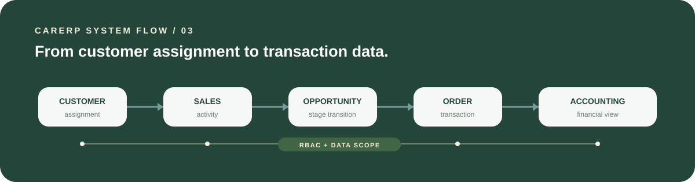
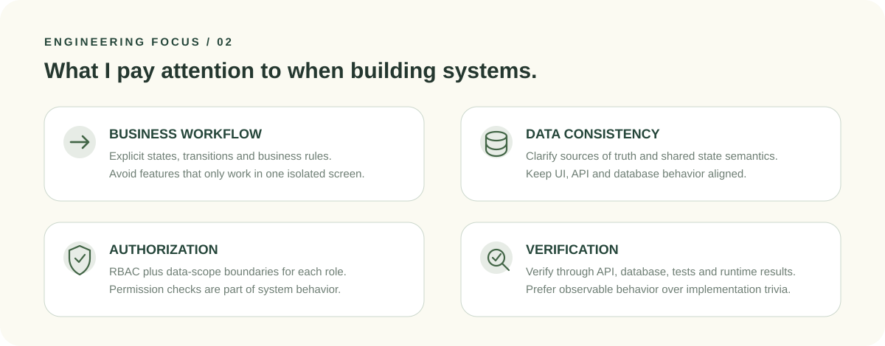
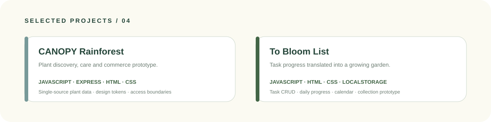

<div align="center">


### Hung｜Java 後端工程師

以 Java、Spring Boot 與 SQL 建構可維護的後端功能，重視業務流程、資料一致性、權限邊界與可驗證行為。

<p>
  
  
  
  
  
  
</p>

[](https://github.com/archcado/CarERP)
[](https://github.com/archcado)

</div>

<br>

### 01 / ABOUT

完成 Java 後端工程師培訓後，我持續透過完整專案練習需求拆解、REST API、SQL 資料建模、身分驗證、角色權限與跨模組流程。

開發時，我會先確認資料來源、狀態轉換與 API 契約，再透過測試、執行結果與可觀察行為驗證功能，而不是只確認畫面「看起來能用」。

目前持續深化 **Java Backend Development、Testing 與 System Design**；AI Agents、Context Engineering 與 Workflow Automation 則作為延伸探索方向。

<br>

### 02 / FEATURED PROJECT

<a href="https://github.com/archcado/CarERP">
  
</a>

#### 智富車庫 CarERP｜二手車商 ERP

以 **Java 21、Spring Boot、Spring Security、SQL Server** 建立的車商管理系統，涵蓋車輛、客戶、業務、訂單、文件、帳務、儀表板與角色權限。

專案重點不只在 CRUD，而是將客戶分配、業務追蹤、商機階段、訂單與帳務等狀態串成可追蹤的業務流程。

**我的負責範圍**

- 業務中心：客戶分配、個人工作台、活動追蹤與六階段銷售漏斗。
- 客戶流程：整理客戶、商機與訂單之間的狀態規則及資料來源。
- 帳務與儀表板：參與帳務介面、角色化儀表板與前後端資料串接。
- API 與跨模組整合：確認資料來源、狀態語意與前後端契約的一致性。
- 權限與驗證：依 `ADMIN`、`SALES`、`ACCOUNTING` 區分功能及資料範圍。

<p align="right">
  <a href="https://github.com/archcado/CarERP"><strong>VIEW CARERP REPOSITORY →</strong></a>
</p>

<br>

### 03 / SYSTEM FLOW



<br>

### 04 / ENGINEERING FOCUS



**可查證的工程重點**

- Controller–Service–Repository 分層與 DTO API 契約。
- JWT 身分驗證、RBAC 角色授權及個人資料範圍檢查。
- 以 JUnit、Mockito 與 GitHub Actions 驗證核心行為。

<br>

### 05 / CORE STACK

| 領域 | 技術與工具 |
| --- | --- |
| **Backend** | Java 21、Spring Boot、Spring MVC、Spring Security、JPA / JDBC、REST API、JWT、Maven |
| **Database** | SQL Server、SQL、PostgreSQL（Schema 與整合練習） |
| **Frontend** | JavaScript、HTML、CSS、Bootstrap、RWD |
| **Testing** | JUnit 5、Mockito、Postman、GitHub Actions |
| **Collaboration** | Git、GitHub、需求拆解、API 契約、Code Review |

<br>

### 06 / SELECTED PROJECTS



<table>
<tr>
<td width="50%" valign="top">

#### CANOPY Rainforest｜植物選購與照護網站

使用 **JavaScript、Node.js / Express、HTML、CSS** 製作植物資料、條件篩選、植物配對、會員、收藏、購物車、訂單與後台管理流程。

- 建立植物資料的單一來源，供篩選、配對與商品頁共用。
- 整理共用元件、Design Tokens、會員與後台的權限邊界。
- 結帳目前建立測試訂單，尚未串接真實金流；n8n 為可設定的伺服器端整合邊界。

[查看 Repository](https://github.com/archcado/rainforest)

</td>
<td width="50%" valign="top">

#### To Bloom List｜任務花園原型

使用 **JavaScript、HTML、CSS、localStorage**，將任務完成進度轉化為植物蒐集與花園成長體驗。

- 已完成任務 CRUD、每日進度、日曆、花園、植物蒐集與每日獎勵流程。
- 前端為可操作原型；Express 後端、PostgreSQL Schema 與 n8n Workflow 為整合基礎或草稿。
- 登入仍在規劃中；任務、進度與蒐集資料目前保存在瀏覽器端。

[查看 Repository](https://github.com/archcado/To-Bloom-List)

</td>
</tr>
</table>

<br>

### 07 / ENGINEERING PRINCIPLES

- **先定義，再實作**：先確認問題、限制、資料來源與驗收標準。
- **以公開行為驗證**：測試 API、畫面輸出與狀態結果，避免綁死內部實作。
- **重視跨模組一致性**：檢查狀態語意、權限、API 契約與共享資料。
- **對 AI 輸出負責**：使用 AI 協助探索與實作，但以程式碼、測試與執行結果完成驗證。

<br>

### 08 / CURRENT FOCUS

```text
NOW
Java Backend
    ↓
Testing
    ↓
System Design
    └────────→ AI-assisted Engineering

Exploring
AI Agents · Context Engineering · n8n · Workflow Automation
```

<div align="center">

<br>

<sub>Build what can be explained, tested, and verified.</sub>


</div>
